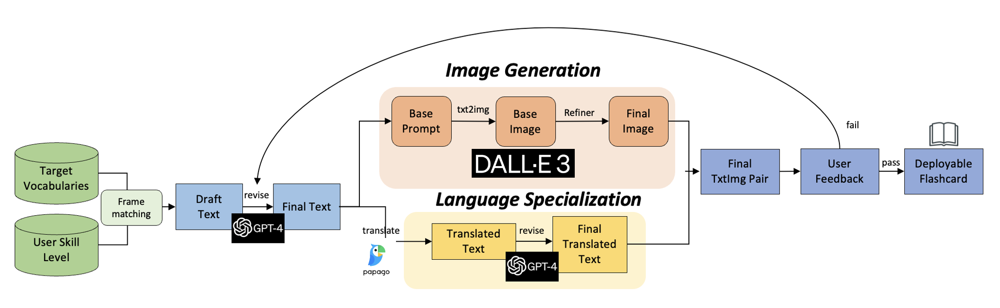

# ImageLingo: Text-Image Pair Generation for Language Learners

## Authors

- Suwon Yoon, Undergraduate, POSTECH
- Taehyeok Ha, Undergraduate, POSTECH

## Introduction

This paper introduces ImageLingo, a platform designed for language learning through automated generation of contextually and visually accurate sentence-image pairs. Utilizing GPT-4 API and Stable Diffusion XL/DALL-E 3, it offers a transformative learning experience. 

## System Architecture

The ImageLingo platform is built with a modular architecture, comprising the following components:



1. **User Input Module**: This component is responsible for capturing user inputs, which could be specific vocabulary words, phrases, or expressions. The interface is designed to be intuitive and easy to use, encouraging users to interact and specify their learning focus.

2. **Sentence Generation Module**: Leveraging the capabilities of GPT-4, this module generates sentences that contextually fit the user-provided vocabulary or expressions. The AI-driven sentence generation ensures variety and relevance, providing users with realistic examples of how words or phrases can be used.

3. **Image Generation Module**: This part of the system employs Stable Diffusion XL and DALL-E 3 to create visual representations of the generated sentences. The images are not only visually appealing but also contextually tied to the sentences, enhancing the learning experience by providing a visual context.

4. **Translation Module**: Integrating the Papago API, this module offers multilingual translation of the generated sentences. This is particularly useful for users who are learning a language different from their native one, as it provides a reliable translation for better understanding.

5. **Unified Display Interface**: The final component is the user interface, which is designed to be clean, intuitive, and user-friendly. It displays the generated sentences and corresponding images side by side, along with translations, creating an immersive learning environment.

## Conclusion

ImageLingo exemplifies the integration of advanced technologies in language learning. By combining AI with user-centered design, it provides a tailored, engaging, and effective educational tool.

## Installation

To run Image Lingo on your local machine, you need to have Python installed. Follow these steps:

1. Clone the repository

    ```bash
    git clone https://github.com/hataehyeok/ImageLingo.git
    cd ImageLingo
    ```

2. Install the required Python packages

    ```bash
    pip install -r requirements.txt
    ```

3. Run the Streamlit application

    ```bash
    streamlit run app.py
    ```

## Development

This application is built using the Streamlit framework, which allows for rapid development of data applications. For contributions or modifications, refer to the Streamlit documentation to understand the structure and capabilities of the framework.

## License

MIT License

## Contact

For any additional questions or comments, please contact the repository owner.
